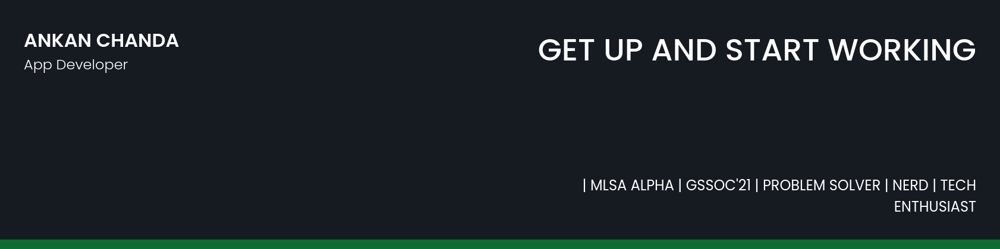

## 🧔 About Me

<!-- - 🔭 I’m currently working on [Recess](https://github.com/Jaagrav/Recess) -->
- 🌱 I’m currently learning **React Native, Android, Django, Kubernetes and React JS**

<!-- - 👯 I’m looking to collaborate on **React/Vue/Vanilla Projects** -->

<!-- - 👨‍💻 All of my projects are available at [https://xjaagrav.vercel.app/projects](https://xjaagrav.vercel.app/projects) -->

<!-- - You can check out my Arduino projects right **[here](https://www.instructables.com/member/xJaagrav/)**. -->

<!-- - 📝 I regularly write articles on [https://xjaagrav.vercel.app/stories](https://xjaagrav.vercel.app/stories) -->

<!-- - 💬 Ask me about **React, Vue, Web Development and UI/UX** -->

- 📫 Contact me **[here](g906360@gmail.com)**

<!-- - 📄 My Resume [https://drive.google.com/file/d/10z7nWMOMKMj2KtOxszcxYI2b0sQrxFpn/view?usp=sharing](https://drive.google.com/file/d/10z7nWMOMKMj2KtOxszcxYI2b0sQrxFpn/view?usp=sharing) -->

<!-- - ⚡ Fun fact **People often call me an alien** -->

<!-- ## ✍ My Work

Here are some of my projects on Github that I am proud of:

 -->

## 📚 My Skills

## 🤝 Connect

